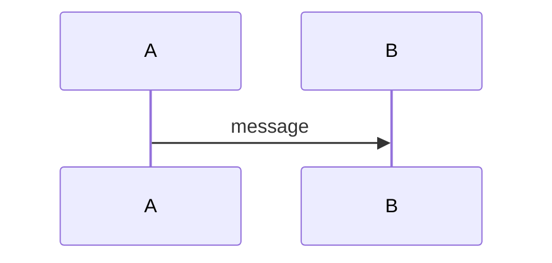

# Protocol Team Docs

Internal documentation site for the Agglayer smart contracts protocol team, built with MkDocs Material.

Repo: [agglayer/protocol-team-docs](https://github.com/agglayer/protocol-team-docs)

## Repo Structure

```
docs/                          All documentation content (Markdown)
  zkEVM/                       1. zkEVM specs (banana, durian)
  tooling/                     2. Tooling (genesis, verification, resources)
  aggregation-layer/           3. Aggregation layer (v0.2.0, v0.3.0, v0.3.5)
  smart-contracts/             4. Smart Contracts (v11, v12, migration paths)
  outposts/                    5. Outposts (intro, L2 deployment)
  sovereign-contracts-roles/   6. SC Roles (L1, aggchain, sovereign chain roles)
  css/                         Custom CSS
  index.md                     Home page
mkdocs.yml                     MkDocs configuration
requirements.txt               Python dependencies
```

## Build & Serve

**Requirements:** Python 3.x, pip

```bash
pip3 install -r requirements.txt   # Install dependencies
mkdocs serve                       # Dev server at http://127.0.0.1:8000/
mkdocs build                       # Build static site to site/
```

## Navigation

Navigation is managed by [mkdocs-awesome-pages-plugin](https://github.com/lukasgeiter/mkdocs-awesome-pages-plugin). Each directory has a `.pages` file defining order and display names. The root nav is in `docs/.pages`.

### `.pages` file format

```yaml
title: "Section Title"
nav:
  - Overview: index.md
  - 1.1 Sub Page: sub-page.md
```

## Markdown Formatting Rules

**CRITICAL: Pay attention to indentation in lists and bullet points.**

- Use **4 spaces** for nested list items (not 2). This ensures proper rendering in both GitHub and MkDocs Material.
- Remove trailing spaces after colons in list items (e.g. `- **Functionality**:` not `- **Functionality**: `).
- Always leave a blank line before and after code blocks, tables, and admonitions.

Correct nested list example:

```markdown
- **Parent item**:
    - Child item 1
    - Child item 2
        - Grandchild item
```

Incorrect (will not render as nested list):

```markdown
- **Parent item**:
  - Child item 1 (only 2 spaces — may break in some renderers)
```

## Section Numbering

When adding, removing, or reordering sections in a page, **always renumber all section headings sequentially** (1, 2, 3... and sub-sections 4.1, 4.2...). Stale or inconsistent numbering is not acceptable.

## Diagrams

This site uses [mkdocs-mermaid2-plugin](https://github.com/fralber/mkdocs-mermaid2-plugin) for diagrams. Use fenced code blocks with `mermaid` language:

````markdown

````

## Plugins

- `awesome-pages` — Directory-level navigation via `.pages` files
- `mermaid2` — Mermaid diagram rendering (v10.4.0)
- `git-revision-date-localized` — Shows last edit date per page
- `img2fig` — Converts images to figures
- `minify` — Minifies HTML output
- `include_dir_to_nav` — Auto-includes directories in navigation
- `search` — Built-in search

## Theme

MkDocs Material with teal color scheme, dark/light toggle, and section navigation.

## Workflow

Branch from `main` → write/edit docs → verify locally with `mkdocs serve` → PR.
