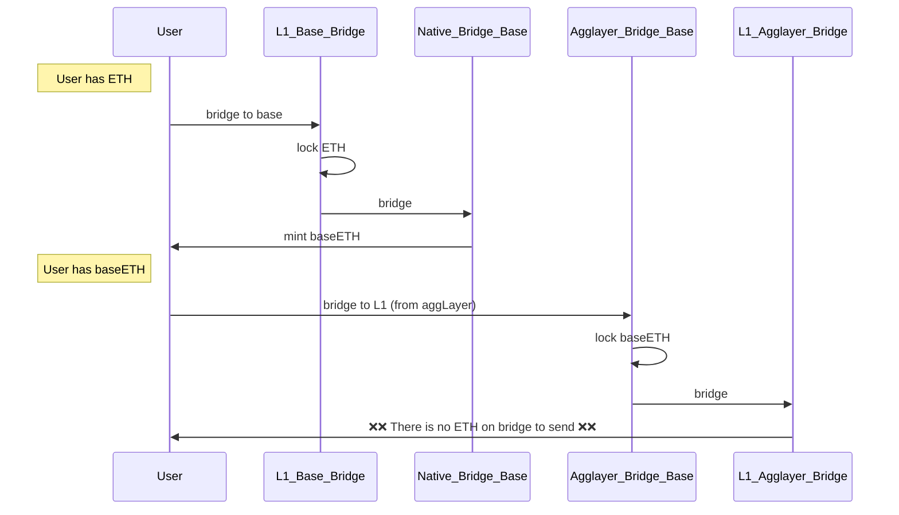
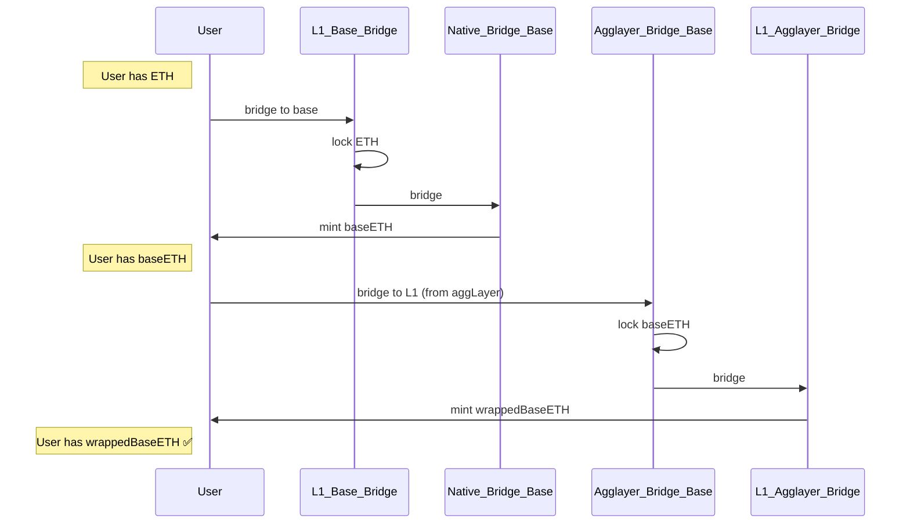

# Intro

## 1. What is an outpost chain?

- Chain that **owns a different native bridge** not controlled by the **PP (Pessimistic Proof)**
- Is **EVM compatible** (in a first stage)
- The chain **already exists**, we are not involved on the genesis
- The **state transition is not controlled** by us (**not controlled sequencer**)
- Has **its own finality**
- All outposts will have a **customGasToken** that will be the native token of the chain
    - Outpost chains can not have native ether token
- **Examples**:
    - Base
    - Optimism
    - BSC

---

## 1.1 Objective

- **Attach an outpost chain to the aggLayer**

## 1.2 Implications
- Deploy SC
- Secure State transition

---

## 1.3 Limitations

- **Bridge, GER and wTokens** have **different addresses**
- Possible reorgs in the outpost chain,so also in the LER
    - A new functions in the bridge to rollback the LER
    - It can create double spending, will be paid by Polygon.

## 1.4 Flow examples
### 1.4.1 Outpost with native ETH
Example flow of an outpost having gasTokenNetwork different than native networkID/rollupID:

- Initialize params:
    - GasTokenNetwork: 0 (ethereum)
    - GasTokenAddress: 0x000....000 (ethereum)

### 1.4.2 Outpost with native token
Example flow of an outpost having gasTokenNetwork same than native networkID/rollupID:
Initialize params:
- GasTokenNetwork: 2 (base rollupId)
- GasTokenAddress: 0x002....002 (custom address)

 
 