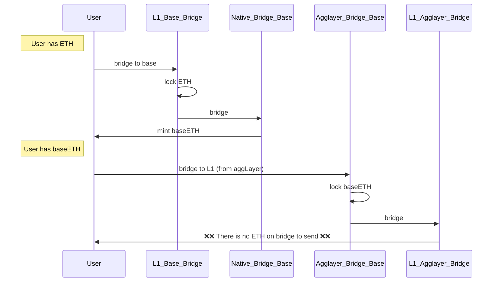
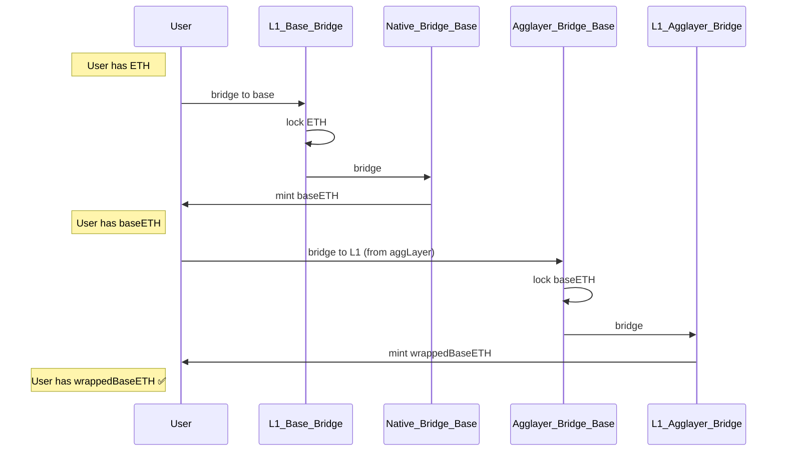

# Intro

## 1. What is an outpost chain

- Chain that **owns a different native bridge** not controlled by the **PP (Pessimistic Proof)**
- Is **EVM compatible** (in a first stage)
- The chain **already exists**, we are not involved on the genesis
- The **state transition is not controlled** by us (**not controlled sequencer**)
- Has **its own finality**
- All outposts will have a **customGasToken** that will be the native token of the chain
    - Outpost chains can not have native ether token
- **Examples**:
    - Base
    - Optimism
    - BSC

---

## 2. Architecture

**Key points:**

- The outpost chain has its **own native bridge** and **sequencer** — neither is controlled by the Agglayer
- Agglayer L2 contracts (`AgglayerBridgeL2`, `AgglayerGERL2`) are deployed **on the outpost chain**
- The **Pessimistic Proof** verifies the bridge activity on the outpost
- The outpost needs the **Agglayer Core SC** to be deployed on the L1 chain

---

## 3. Particularities

- **Bridge, GER and wTokens** have **different addresses**
- Reorgs can happen not controlled by the agglayer
    - New functions in the bridge to manage Local Exit Tree possible mismatches

## 4. Flow examples
### 4.1 Outpost with native ETH
Example flow of an outpost having gasTokenNetwork different than native networkID/rollupID:

- Initialize params:
    - GasTokenNetwork: 0 (ethereum)
    - GasTokenAddress: 0x000....000 (ethereum)

```mermaid
sequenceDiagram
    participant User
    participant L1_Base_Bridge
    participant Native_Bridge_Base
    participant Agglayer_Bridge_Base
    participant L1_Agglayer_Bridge

    Note left of User: User has ETH
    User ->> L1_Base_Bridge: bridge to base
    L1_Base_Bridge ->> L1_Base_Bridge: lock ETH
    L1_Base_Bridge ->> Native_Bridge_Base: bridge
    Native_Bridge_Base ->> User: mint baseETH
    Note left of User: User has baseETH
    User ->> Agglayer_Bridge_Base: bridge to L1 (from aggLayer)
    Agglayer_Bridge_Base ->> Agglayer_Bridge_Base: lock baseETH
    Agglayer_Bridge_Base ->> L1_Agglayer_Bridge: bridge
    L1_Agglayer_Bridge ->> User: ❌❌ There is no ETH on bridge to send ❌❌
```

### 4.2 Outpost with native token
Example flow of an outpost having gasTokenNetwork same than native networkID/rollupID:
Initialize params:
- GasTokenNetwork: 2 (base rollupId)
- GasTokenAddress: 0x002....002 (custom address)

```mermaid
sequenceDiagram
    participant User
    participant L1_Base_Bridge
    participant Native_Bridge_Base
    participant Agglayer_Bridge_Base
    participant L1_Agglayer_Bridge

    Note left of User: User has ETH
    User ->> L1_Base_Bridge: bridge to base
    L1_Base_Bridge ->> L1_Base_Bridge: lock ETH
    L1_Base_Bridge ->> Native_Bridge_Base: bridge
    Native_Bridge_Base ->> User: mint baseETH
    Note left of User: User has baseETH
    User ->> Agglayer_Bridge_Base: bridge to L1 (from aggLayer)
    Agglayer_Bridge_Base ->> Agglayer_Bridge_Base: lock baseETH
    Agglayer_Bridge_Base ->> L1_Agglayer_Bridge: bridge
    L1_Agglayer_Bridge ->> User: mint wrappedBaseETH
    Note left of User: User has wrappedBaseETH ✅
```

 
 