# Outpost L2 contracts
[TOC]

### 🔍 What is an outpost chain?

- Chain that **owns a different native bridge** not controlled by the **PP (Pessimistic Proof)**
- Is **EVM compatible** (in a first stage)
- The chain **already exists**, we are not involved on the genesis
- The **state transition is not controlled** by us (**not controlled sequencer**)
- Has **its own finality**
- All outposts will have a **customGasToken** that will be the native token of the chain
    - Outpost chains can not have native ether token
- **Examples**:
  - Base
  - Optimism
  - BSC

---

### 🎯 Objective

- **Attach an outpost chain to the aggLayer**

### Implications
- Deploy SC
- Secure State transition

---

### ⚠️ Limitations

- **Bridge, GER and wTokens** have **different addresses**
- Possible reorgs in the outpost chain,so also in the LER
    - A new functions in the bridge to rollback the LER
    - It can create double spending, will be paid by Polygon.

#### Flow examples
### Outpost with native ETH ❌
Example flow of an outpost having gasTokenNetwork different than native networkID/rollupID:
Initialize params:
- GasTokenNetwork: 0 (ethereum)
- GasTokenAddress: 0x000....000 (ethereum)

### Outpost with native token ✅
Example flow of an outpost having gasTokenNetwork same than native networkID/rollupID:
Initialize params:
- GasTokenNetwork: 2 (base rollupId)
- GasTokenAddress: 0x002....002 (custom address)

```mermaid
sequenceDiagram
    participant User
    participant L1_Base_Bridge
    participant Native_Bridge_Base
    participant Agglayer_Bridge_Base
    participant L1_Agglayer_Bridge

    Note left of User: User has ETH
    User ->> L1_Base_Bridge: bridge to base
    L1_Base_Bridge ->> L1_Base_Bridge: lock ETH
    L1_Base_Bridge ->> Native_Bridge_Base: bridge
    Native_Bridge_Base ->> User: mint baseETH
    Note left of User: User has baseETH
    User ->> Agglayer_Bridge_Base: bridge to L1 (from aggLayer)
    Agglayer_Bridge_Base ->> Agglayer_Bridge_Base: lock baseETH
    Agglayer_Bridge_Base ->> L1_Agglayer_Bridge: bridge
    L1_Agglayer_Bridge ->> User: mint wrappedBaseETH
    Note left of User: User has wrappedBaseETH ✅
```

 
 

## Deploy Outpost Chain Script 

The tooling specifications and code can be found [here](https://github.com/agglayer/agglayer-contracts/blob/v12.1.0-rc.2/tools/deployOutpostChain/README.md)

## Overview

The **deployOutpostChain** script is an automated deployment solution designed to facilitate the establishment of sovereign blockchain networks within the Agglayer ecosystem. This tool provides a streamlined approach to deploying all necessary smart contracts required for an outpost chain implementation.

## Primary Objective

The script serves as a comprehensive deployment framework for creating sovereign blockchain networks with integrated cross-chain bridging capabilities. It enables the deployment of blockchain infrastructure that supports:

- **Cross-chain asset transfers** and token bridging functionality
- **Global exit root management** for secure cross-chain transaction finalization
- **Decentralized governance mechanisms** through timelock controllers
- **Optional oracle committee integration** for enhanced security and decentralization

## Core Contract Deployments

The deployment process encompasses five primary smart contracts:

### 1. TimelockController
- **Purpose**: Implements governance timelock mechanisms for secure contract upgrades
- **Function**: Provides time-delayed execution of administrative operations

### 2. ProxyAdmin
- **Purpose**: Manages proxy contract upgrade processes
- **Function**: Controls the upgrade lifecycle of proxied contracts

### 3. BridgeL2SovereignChain
- **Purpose**: Facilitates cross-chain asset transfers
- **Function**: Handles token deposits, withdrawals, and cross-chain communication

### 4. GlobalExitRootManagerL2SovereignChain
- **Purpose**: Manages the global exit root merkle tree
- **Function**: Maintains cryptographic proofs for cross-chain transaction validation

### 5. AggOracleCommittee *(Optional)*
- **Purpose**: Provides decentralized oracle functionality
- **Function**: Enables committee-based validation of cross-chain data through consensus mechanisms

## Additional Infrastructure Components

The deployment includes several auxiliary contracts:

- **WrappedTokenBytecodeStorer**: Optimizes contract size by storing token bytecode externally
- **WrappedTokenBridgeImplementation**: Serves as template for wrapped token deployments
- **BridgeLib**: Contains shared bridge functionality to reduce contract complexity
- **WETH Token**: Chain-specific wrapped Ether implementation

## Key Architectural Features

### Automated Configuration Management
- **Address Pre-calculation**: Utilizes deterministic address generation for circular dependency resolution
- **Parameter Derivation**: Automatically calculates gas token addresses and network identifiers
- **Governance Integration**: Establishes proper ownership hierarchies and access controls

### Security Mechanisms
- **Proxy Pattern Implementation**: Enables secure contract upgrades through established patterns
- **Timelock Governance**: Enforces delayed execution for critical administrative functions
- **Multi-signature Oracle Support**: Provides optional decentralized validation through committee consensus

### Deployment Flexibility
- **Configurable Oracle Systems**: Supports both single-oracle and committee-based configurations
- **Standardized Deployment Process**: Utilizes OpenZeppelin's established upgrade patterns
- **Comprehensive Validation**: Includes automated verification of deployment integrity

## Target Use Cases

This deployment script is specifically designed for:

- **Sovereign Chain Operators**: Organizations establishing independent blockchain networks
- **Layer 2 Solution Providers**: Teams implementing scalable blockchain solutions
- **Cross-chain Protocol Developers**: Projects requiring interoperability with the Polygon ecosystem
- **Enterprise Blockchain Initiatives**: Organizations deploying private or consortium chains with bridging capabilities

The tooling specifications and code can be found [here](https://github.com/agglayer/agglayer-contracts/blob/v12.1.0-rc.2/tools/deployOutpostChain/README.md)